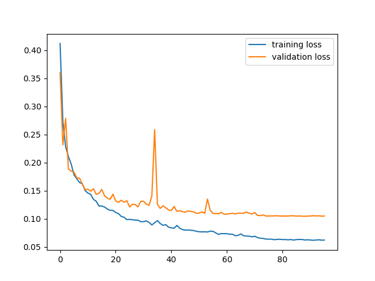
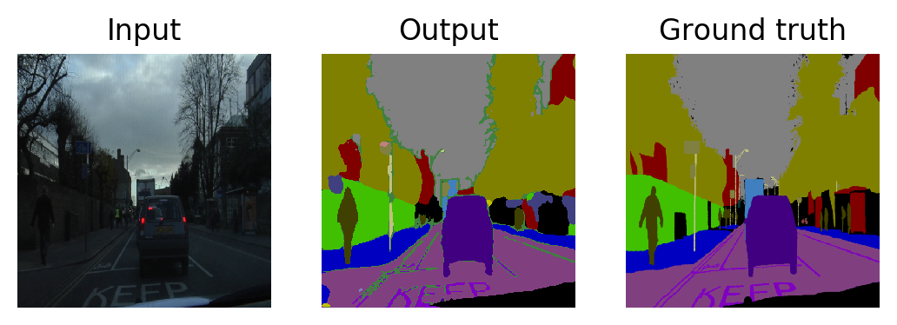
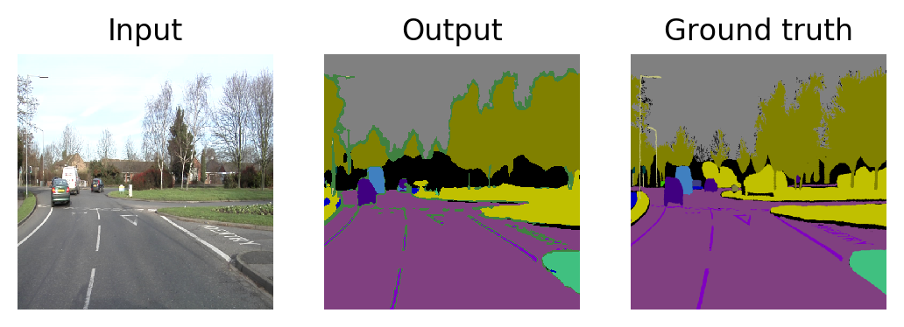
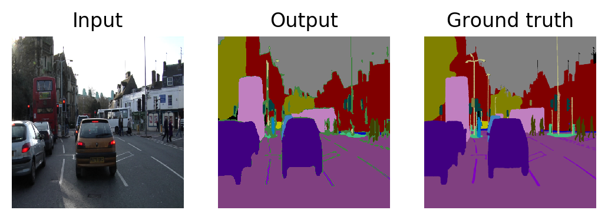
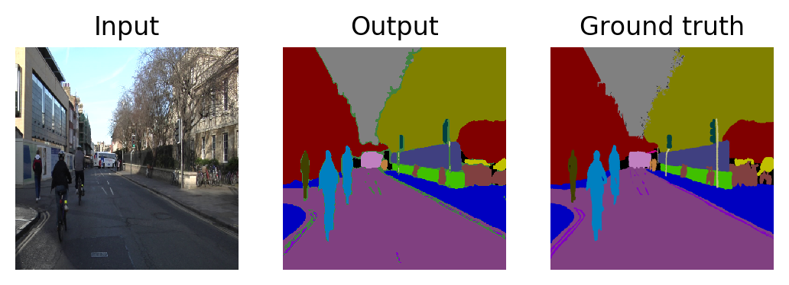
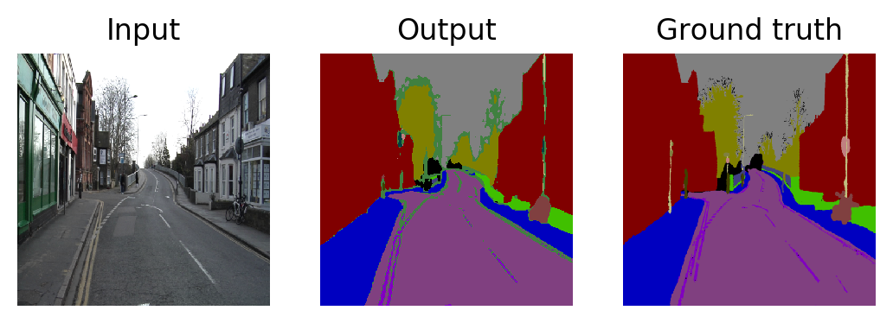
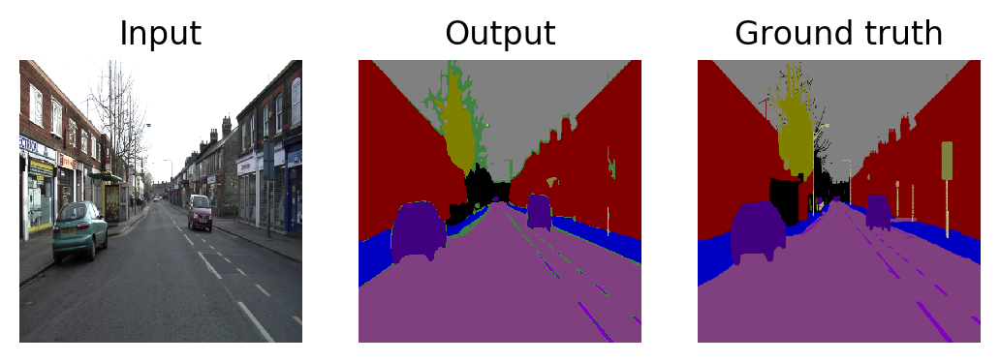

# DeepLab v3
## General
This is a PyTorch implementation of [DeepLab-V3-Plus](https://arxiv.org/pdf/1802.02611) for semantic image segmentation. Currently, I use Resnet as backbone and train the model using the [Cambridge-driving Labeled Video Database (CamVid) dataset](http://mi.eng.cam.ac.uk/research/projects/VideoRec/CamVid).

## Files

```
.
├── data
│   └── CamVid
│       ├── test
│       ├── test_labels
│       ├── train
│       ├── train_labels
│       ├── val
│       └── val_labels
├── output
│   ├── log.txt
│   ├── loss.png
│   └── weight.pth
├── results
├── dataset.py
├── helper.py
├── loss.py
├── model.py
├── predict.py
├── train.py
└── README.md

```
### Training
```
python train.py
```
Training and validation loss:


### Testing
```
python test.py
```
Some experimental results:







